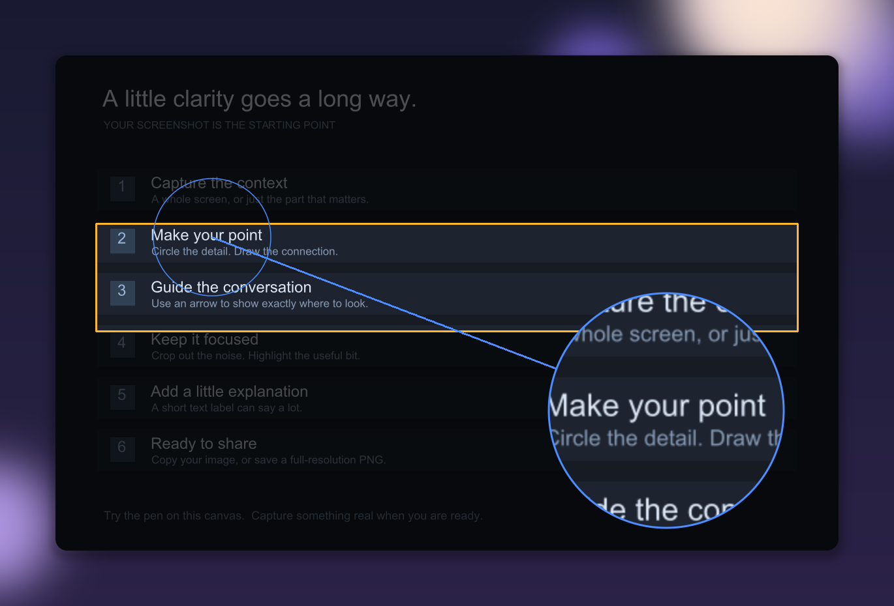

# Glance

**Make your screenshot make sense.**

Glance is a native screenshot editor for clearer bug reports, design feedback,
and visual context for coding agents. It runs on macOS, with experimental support
for Omarchy (Linux/Hyprland). Capture the detail, mark what
matters, then copy an image or share a temporary link through
[glance.sh](https://glance.sh).



*Made in Glance: spotlight and magnifier on the built-in practice canvas, framed
with a Lava backdrop. This PNG captures one frame of the animation.*

## From screenshot to shared context

- **Capture without breaking your flow.** Global shortcuts grab an area or the
  main display. Open an existing image, paste from the clipboard, or drop a file.
- **Point to the problem.** Add curved arrows, text, highlights, shapes, and
  numbered steps. Select, move, restyle, and undo your annotations.
- **Bring the detail forward.** Dim distractions with a spotlight or enlarge a
  small detail with a magnifier.
- **Give it a finished frame.** Add padding, rounded corners, shadows, and solid
  or gradient backdrops. Choose a square, portrait, or landscape format.
- **Put the background in motion.** Eight animated styles export as looping GIFs
  or MP4s while your screenshot and annotations stay still.
- **Share with a remote agent.** Copy a temporary image URL that an agent can
  fetch, or use the local MCP companion to let a client edit the native canvas.

Written in Rust with [GPUI](https://www.gpui.rs/). macOS uses Metal and native
video helpers; Linux uses GPUI’s Vulkan UI, Wayland capture tools, and FFmpeg. Capture, editing, and file export work locally; remote
sharing is optional.

## Build and install

Glance is in early development. **Build from source** to try it; there are no
published app downloads yet.

### macOS

Requires **macOS 12+**, Xcode Command Line Tools, and a current stable Rust
installation via [rustup](https://rustup.rs/). Full Xcode and FFmpeg are not
required. Development is currently verified on Apple Silicon.

```sh
xcode-select --install # Only if Command Line Tools are not installed.
git clone https://github.com/modem-dev/glance-desktop.git
cd glance-desktop
./scripts/bundle.sh
```

The first bundle build creates a persistent local signing certificate. If it
stops with a certificate-trust message, review and run the one-time setup, then
build again:

```sh
./scripts/trust-local-signing.sh
./scripts/bundle.sh
```

That step adds trust for the local development certificate for code signing in
your user Keychain. Then install and launch:

```sh
mkdir -p ~/Applications
ln -s "$(pwd)/target/Glance.app" ~/Applications/Glance.app
open ~/Applications/Glance.app
```

The link keeps your installed app up to date when you rebuild. On your first
capture, grant Glance **Screen Recording** in **System Settings → Privacy &
Security** (called **Screen & System Audio Recording** on newer macOS), then
quit and relaunch. Use the bundled app consistently so permissions stay tied
to its signing identity.

See [development and troubleshooting](docs/development.md) for fast builds,
custom signing identities, and permission fixes.

### Omarchy / Arch Linux (experimental)

CI builds an **x86_64 Arch package** for Omarchy. Download the
`glance-omarchy-x86_64` artifact from a successful
[CI run](https://github.com/modem-dev/glance-desktop/actions/workflows/ci.yml),
extract it, then install the included package:

```sh
sudo pacman -U ./glance-desktop-*.pkg.tar.zst
glance --capture-area
```

The package declares dependencies for Wayland capture, clipboard, dialogs,
fonts, and FFmpeg. Your GPU needs a working Vulkan driver. Add optional Hyprland
bindings to capture from anywhere; see the [Omarchy guide](docs/linux.md).
Use **Ctrl** in place of **⌘** for editor shortcuts.

CI also uploads an Apple Silicon macOS ZIP, ad-hoc signed for development.
These are test builds with 14-day retention, not notarized public releases.
Source builds remain available; the [Omarchy guide](docs/linux.md) covers them.

## Your first screenshot

1. Press **⌘⌥2** to select an area, or **⌘⌥3** to capture the main display.
2. Press **A** and draw an arrow. Press **T**, click, and type a label.
3. Press **⌘C** to copy the composed image or **⌘S** to save a PNG.
4. For a remote coding agent, press **⌘⇧C** to copy a temporary Glance link and
   paste it into the agent's chat.

The app opens with a practice canvas, so you can try the tools before capturing.
Open **Backdrop → Motion** and choose a style to export an animated GIF or MP4
from the **Export** menu.

| Task | Shortcut |
| --- | --- |
| Select and move an annotation | V |
| Pen / arrow / rectangle / text | P / A / R / T |
| Highlight / pixelate / crop | H / B / X |
| Numbered callout / spotlight / magnifier | N / S / M |
| Undo / redo | ⌘Z / ⌘⇧Z |
| Open / paste an image | ⌘O / ⌘V |
| Fit / actual size | ⌘1 / ⌘0 |

[Full usage guide →](docs/usage.md)

## Sharing and privacy

**⌘C** copies locally. **⌘⇧C** explicitly uploads the composed PNG using
Glance's client encryption and copies `Screenshot: <url>`. Anyone with the link
can retrieve the image until it expires, usually after about 30 minutes. The
hosted service requires internet and currently limits uploads to 15 MB and 30
uploads per hour per IP. Treat the URL as a secret.

The [local MCP companion](mcp/README.md) is opt-in: launch Glance with
`--automation` to enable its local editor bridge. A connected client can read
and edit images and export files with your user account's access. Connecting a
remote client may send image previews through that client's transport.

## Current limits

Glance edits one image at a time. **Save or copy before replacing the image or
quitting**; editable sessions are not persisted. Crop out information you need
to remove before sharing; pixelation is a visual effect.

OCR, scrolling capture, floating pins, configurable shortcuts, persistent
settings, automatic updates, and notarized app distribution are not available
yet. MP4 and GIF animate the backdrop, not a screen recording. Windows is not
supported. Omarchy support is experimental: CI checks builds, virtual UI tests,
and video exports; desktop capture/input still need a real Hyprland acceptance
pass. Animated Linux backdrops currently render on the CPU.

## Contribute

Bug reports, focused improvements, and documentation fixes are welcome. Start
with [CONTRIBUTING.md](CONTRIBUTING.md) for setup, checks, and pull request
expectations. Report bugs or propose features in
[GitHub Issues](https://github.com/modem-dev/glance-desktop/issues).

- [Usage](docs/usage.md) — tools, shortcuts, backdrops, and exports.
- [Omarchy / Linux](docs/linux.md) — installation, capture bindings, and limits.
- [Development](docs/development.md) — builds, signing, permissions, and releases.
- [Architecture](docs/architecture.md) — editor, document actions, and workers.
- [MCP companion](mcp/README.md) — setup, tools, and editor actions.
- [Security policy](SECURITY.md) · [Changelog](CHANGELOG.md).

## License

[MIT](LICENSE). Third-party code and assets retain their own licenses; see
[third-party notices](THIRD_PARTY_NOTICES.md).
